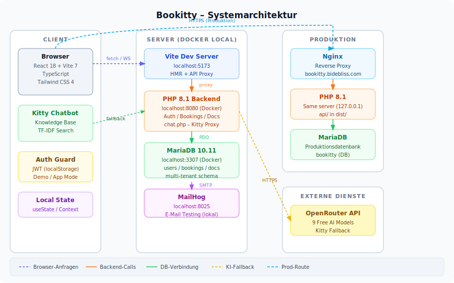

# Bookitty

Moderne Finanzbuchhaltungs-WebApp für Schweizer KMU — mit KI-Chatbot, automatischer Belegerkennung und intuitiver Buchungserfassung.

## Funktionen

### Buchhaltung
- **Dashboard** – Kennzahlen, Kontostand, letzte Buchungen auf einen Blick
- **Buchungen** – Einnahmen/Ausgaben erfassen, bearbeiten, nach Zeitraum/Kategorie filtern
- **Bilanz** – Aktiven/Passiven nach Schweizer KMU-Kontenrahmen, PDF-Export
- **Erfolgsrechnung** – Ertrag/Aufwand-Übersicht mit Jahresvergleich
- **Dokumente** – PDF- und Bildbelegs-Import mit automatischer OCR-Erkennung

### Kitty – KI-Chatbot
- **Offline-First Knowledge Base** – 60+ Q&A-Einträge zu Bookitty-Funktionen, Schweizer Buchhaltung, MwSt und mehr
- **Agentic UI**: Kitty kann direkt im Interface agieren:
  - **Nav-Highlight** – blinkt das relevante Menü-Element grün auf
  - **Buchungsvorschläge** – zeigt vorausgefüllte Buchungskarte mit Soll/Haben/MwSt
  - **Direkt erfassen** – ein Klick öffnet das Buchungsformular mit allen Werten vorausgefüllt
- **OpenRouter-Fallback** – 9-Modell-Kette (kostenlose Modelle) für Fragen ausserhalb der Knowledge Base

### Authentifizierung
- Registrierung / Login mit JWT
- Demo-Modus ohne Account (Daten nur lokal)

## Architektur



## Tech Stack

| Frontend | Backend |
|---|---|
| React 18 + Vite 7 | PHP 8.1 |
| TypeScript | MariaDB 10.11 |
| Tailwind CSS 4 | JWT Auth |
| React Router 7 | Docker (lokal) |

## Lokale Entwicklung

### Voraussetzungen

- [Node.js](https://nodejs.org/) (LTS)
- [Docker Desktop](https://www.docker.com/products/docker-desktop/)

### Setup

```bash
# 1. Abhängigkeiten installieren
npm install

# 2. Docker-Stack starten (PHP + MariaDB)
docker compose up -d

# 3. API-Config kopieren und anpassen
cp api/config.example.php api/config.php

# 4. Frontend starten
npm run dev
```

Frontend läuft auf **http://localhost:5173**, Backend auf **http://localhost:8080**.

### Build erstellen

```bash
npm run build
npm run preview   # Vorschau des Builds
```

## Projektstruktur

```
src/
├── components/     # UI-Komponenten (BookingForm, KittyChat, …)
├── data/           # kittyKnowledge.ts – Offline Knowledge Base
├── hooks/          # useKittyHighlight, useAuth, …
├── layout/         # AppLayout (Sidebar, Mobile Nav)
├── pages/          # Dashboard, Buchungen, Bilanz, Dokumente, …
└── utils/          # kittySearch (TF-IDF), documentParser, …
api/
├── auth/           # Login, Register, Me
├── bookings/       # CRUD Buchungen
├── documents/      # Upload, OCR-Erkennung
└── chat.php        # Kitty / OpenRouter-Proxy
```

## Umgebungsvariablen (api/config.php)

| Konstante | Beschreibung |
|---|---|
| `DB_HOST` / `DB_NAME` | MariaDB-Verbindung |
| `JWT_SECRET` | 64-Zeichen Zufalls-String |
| `KITTY_API_KEY` | OpenRouter API Key ([openrouter.ai/keys](https://openrouter.ai/keys)) |

> **Hinweis:** `api/config.php` ist gitignored. Vorlage: `api/config.example.php`

## Deployment

Die App läuft produktiv auf **https://bookitty.bidebliss.com**.

Frontend: statisches Build via `npm run build` → `dist/`  
Backend: PHP auf demselben Server, Nginx als Reverse Proxy

